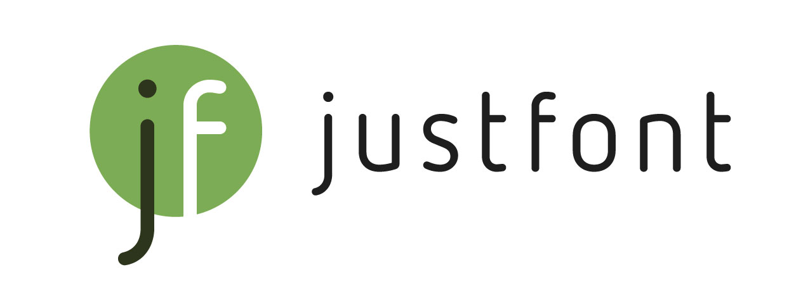

      

# 簡語生活體 AbbrFesFont

_Less is More._ — Ludwig Mies van der Rohe

## 計劃緣起

簡語，一直都在我們的社會中。不是只有`傳小`、`敏牙`、`情勒`等年輕世代的流行語。`央行`、`健保`、`地檢署`，也都是我們習以為常的簡語。

**不只有效率，也是生活情趣。人人之間的小暗號，讓關係更加緊密。**

作為設計人，我們相信那句名言：「少即是多（Less is More）」—— 在 2025 的愚人節，justfont 邀你一起慶祝簡單的溝通。話少了，效率增加了，樂趣更多了。

本著 Less is More 的精神與字型的專業，justfont 提出完美的簡語解決方案：字型檔。

## 使用效果是？

文字承載著語言。在這個時代表現簡語最佳的形式，理當是字型檔。

只要輸入文字如台北車站、中央銀行、全民健康保險，甚或永遠支持、傳統小吃、飯店早餐，「簡語生活體」就會自動濃縮為 `北車`、`央行`、`健保`、`永支`、`傳小`、`飯早` 等簡語。

## 規格簡介

「簡語生活體」是基於辰宇落雁體字型修改而來，由 justfont 團隊搜羅時下流行簡語、常見台灣上市公司簡稱以及經典常用簡語等超過 1000 個詞條製作而成。

透過 OpenType 的連字技術，製作出輸入特定詞語時，就會自動替換為相關簡語的開源繁體中文字型。

想要用簡語跟朋友搏感情、跟社群拉近距離，或想展示自己永遠走在流行語的時代尖端，我們推薦使用簡語生活體。

本字型以 SIL Open Font License 1.1 授權釋出，歡迎大家自由應用，並分享給你所有的朋友。

## 下載與使用

### 下載

- 請 [點我](https://github.com/justfont/AbbrFesFont/releases/download/v1.0/AbbrFesFont.ttf) 直接下載，或是點選 [Releases 頁面](https://github.com/justfont/AbbrFesFont/releases) 查看最新發行版本。
- 或前往 justfont 網站使用 [產生器](https://justfont.com/justforfun/abbrfesfont) 。

### 使用

- Pages, Keynote, Adobe Illustrator, Adobe Photoshop, Microsoft Word, 下筆, Procreate, InShot 等多數圖像影音編輯與文書軟體：皆可正確顯示所有替換功能（部分軟體需手動開啟連字樣式功能）。
- Microsoft Excel, Microsoft PowerPoint：英文替換無法使用。
- 因運用 OpenType 連字功能，在部分軟體中，若詞條遇到斷行可能無法自動簡化，需另手動調整文字段落。
- 在 Adobe Illustrator 如果無法正確顯示簡語，請到上方選單選取「Illustrator > 偏好設定／設定 > 文字」，打開視窗後，將「語言選項」改勾選「顯示印度選項」，並重新啟動軟體。若仍未正確顯示，則再選取使用簡語生活體的文字，在上方工具列點選「段落」，點選右上角選單展開，勾選「中東和南亞單行撰寫程式」，即可正確顯示簡語效果。

## 支援顯示文字

收錄詞條表請見傳送門，並由 justfont 團隊工人智慧增加社群提案之簡語。

理論上簡語生活體可無限期應用，但因 justfont 人力與時間有限，目前暫無規劃確切更新時程，還請見諒。也歡迎有志之士自行改作新款開源字型釋出。

## 應用範例

1. 快速台灣招呼語呼叫（親切加分 👍）
   - 歡迎光臨 → `緩光臨`
   - 謝謝光臨 → `寫光您`
   - 需要什麼 → `蕭什麼`
   - 不好意思 → `報思`
   - 您好 → `鳥`

2. 台灣常見上市公司簡稱速查（方便 😍）
   - 台灣積體電路製造股份有限公司 → `台積電`
   - 台灣塑膠工業股份有限公司 → `台塑`
   - 中國信託金融控股股份有限公司 → `中信金`

3. 快速轉換為簡語作文（非常實用 🤗）
   - 今天的我因為太想吃傳統小吃，想去台北車站附近看一下，吃完之後順便去 K 書中心讀書。誰知道我男朋友打給我說他昨天成果發表很累，今天想吃珍奶加雞排，要大杯奶茶微糖微冰。我說「你愛吃，我永遠支持，但你昨天不是才說為了我們的夢幻婚禮要飲食控制嗎？」結果他回我「受夠你情緒勒索」就掛我電話。現在是見笑轉生氣嗎？啊，你知道嗎，這段感情只有我在付出。 （148 字）
   - ↓
   - `尖`的我因為太想吃`傳小`，想去`北車`附近看一下，吃完之後順便去`K中`讀書。`誰造`我男友打給我說他昨天`成發`很累，今天想吃`奶雞`，要`大奶微微`。我說「你愛吃，我`永支`，但你昨天不是才說為了我們的`夢婚`要`飲控`嗎？結果他回我「受夠你`情勒`」就掛我電話。現在是`見轉`嗎？啊，你`造`嗎，`這感我付`。（113 字）

## 免費使用、敬請分享

簡語生活體改作於辰宇落雁體開源專案，並基於 SIL Open Font License 1.1 開源協議授權釋出。

您可以放心地：

- **自由應用**：無需付費、知會或標明原作者，即可自由使用或研究本字型，亦可用為商業應用，惟不可將本字體作為產品販售。
- **自由散布**：可自由分享、複製本字體檔案，或是將字體檔案安裝於任何軟硬體中。
- **自由改作**：可自由將字型檔案修改重製為其他字型檔案，惟改作後的字型檔案仍須同樣依 SIL Open Font License 釋出。

完整的 SIL Open Font License 1.1 詳見 https://openfontlicense.org/

## 特別感謝

- 辰宇落雁體：[GitHub Repo](https://github.com/Chenyu-otf/chenyuluoyan_thin)
- [陪沈團](https://www.youtube.com/@playwithshen)提供諸多有趣流行簡語
- 所有愛字的好夥伴們，與看到這裡的你

---

# 關於 justfont

justfont 官方網站： [https://justfont.com](https://justfont.com/)

字體不但佔據閱讀的目光，也引導了生活中的每個決定。字體更構築了城市街道的風景，是關乎美感，最重要的視覺纖維。在人人都能用字型的時代，更能透過方便的科技，將專家職人的心血結晶應用在生活中。

可惜，臺灣長期以來，不論學院或產業，字體都未能得到足夠關注，也缺乏深度耕耘。不僅導致設計從業者能力斷層，一般民眾也對每日都會用到的字體缺乏認識。長久以往，街道上充斥不易理解、不甚美觀的字體排印。版權觀念薄弱，盜版盛行，更導致字型廠商在消費端無立足之地，紛紛轉型或外移。如此負向循環，讓臺灣的「文字風景」難以起色。

justfont 相信字體的價值，更相信好的字體能啟發社會。除了細心栽培一筆一劃，我們更願做字體推廣教育的先行者、教育者與輔導者，致力於培育臺灣下一代的設計力量。從基礎建設與教育開始，提升臺灣的美學環境。邀請您一起來，創造更好的文字風景。

---

# 免責事項

本字型基於開源授權釋出，對本字型的下載、安裝、與安裝後相關之問題，及可能導致之一切可能損害，justfont 皆不承擔相關責任。

此外，我們雖然經過數次校對，但並不擔保字型內絕對沒有錯誤。若您有應用在正式場合的需求，請自行確認、校正文字之正確性。
